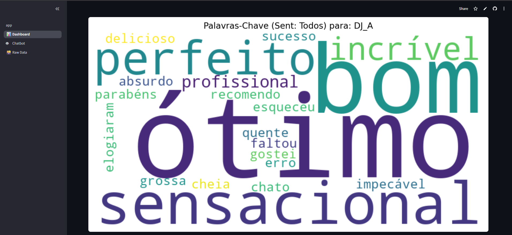
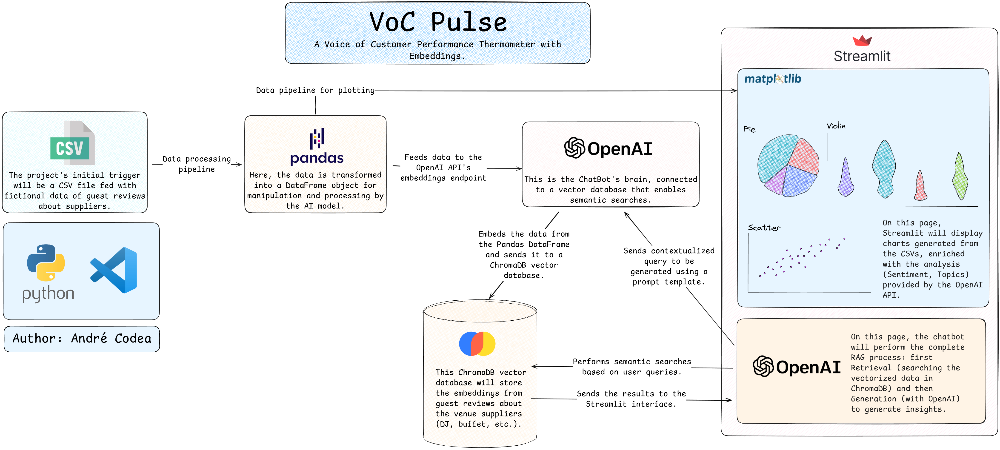

# 🌡️ VoC Pulse
*A Voice of Customer Performance Thermometer with Embeddings*

[](https://www.python.org/)
[](https://streamlit.io)
[](https://opensource.org/licenses/MIT)

**VoC Pulse** is an AI-powered analytics platform designed to interpret unstructured customer feedback. Currently operating as a Proof-of-Concept (POC) developed in a 48-hour sprint, it transforms qualitative data (reviews, comments) into quantitative insights using Embeddings and Large Language Models (LLMs).

It automatically processes text to extract three key data points: **Sentiment** (Positive, Negative, Mixed), **Topic** (e.g., "Buffet", "DJ"), and **Vector Embeddings** for semantic search.

---

## 🚀 Live Demo

**[>> LIVE APP DEMO ON STREAMLIT CLOUD <<](https://voc-pulse.streamlit.app/)**

---

## 📸 Screenshots



---

## 🌟 Core Features (V1 - Current)

* **KPI Dashboard:** An interactive dashboard visualizing supplier performance based on real customer sentiment using **Plotly** (Trend Charts) and **Matplotlib** (Distribution).
* **Semantic Pie Charts:** Interactive breakdown of sentiment for specific, user-selected suppliers.
* **Targeted Word Clouds:** A dynamic generator showing frequent *keywords* filtered by a "whitelist" of value-words (e.g., "great", "cold", "late") for specific suppliers.
* **Manual RAG Chatbot:** A custom-built Retrieval-Augmented Generation (RAG) pipeline. It bypasses standard framework limitations by manually orchestrating `OpenAI` and `ChromaDB` to allow managers to chat with data in plain English.

---

## 🗺️ Product Roadmap: Journey to a Cognitive System (V2)

We are currently transitioning VoC Pulse from a **Descriptive Tool** (what happened?) to a **Prescriptive & Cognitive System** (what will happen and what to do?).

### 📅 Week 1: Foundation & Refactoring
* **Objective:** Pay technical debt and prepare the environment for scale.
* - [ ] **Clean Environment:** Migrate to a clean `venv` with Python 3.11.
* - [ ] **Official RAG Stack:** Replace the "Manual RAG" hack with the official **LangChain** implementation (`RetrievalQA`) to enable memory and tools.
* - [ ] **Observability:** Integrate **LangSmith** for tracing Chain-of-Thought and debugging latency.
* - [ ] **Testing:** Implement unit tests (`pytest`) for critical metrics and data ingestion logic.

### 📅 Week 2: Data Engineering & Automation (CI/CD)
* **Objective:** Scale data volume and automate ingestion.
* - [ ] **Dataset V2:** Expand synthetic data to **1,000+ rows**, adding temporal patterns and new columns (`Event_Type`, `Contract_Value`).
* - [ ] **GitHub Actions:** Deploy a CI/CD pipeline (`update_data.yml`) to execute the AI enrichment script automatically (Cron Job: Monthly), removing manual execution.

### 📅 Week 3: Predictive Intelligence (Machine Learning)
* **Objective:** Implement the "Risk Calculator".
* - [ ] **Model Training:** Train a **RandomForestClassifier** (Scikit-Learn) to predict the probability of negative feedback.
    * *Features:* Supplier ID, Event Type, Value.
    * *Target:* Negative Sentiment.
* - [ ] **New UI:** Add a `Predictions` page where managers can simulate scenarios (e.g., "If I hire DJ 'X' for a Wedding, what is the risk?").

### 📅 Week 4: The Cognitive Agent (ReAct)
* **Objective:** Transform the Chatbot into an Autonomous Agent.
* - [ ] **Tool Creation:** Wrap the RAG pipeline and the ML Model into LangChain **Tools**.
* - [ ] **ReAct Framework:** Implement a Reason-Action Agent that can decide: *"Should I look up history (RAG) or calculate risk (ML) to answer this user?"*
* - [ ] **Real-time Learning:** Create a tool allowing the Agent to ingest new feedback into ChromaDB in real-time.

---

## 🏛️ Architecture Diagram (V1)

This project currently uses a 2-phase "Smart Hack" architecture to ensure sub-3-second load times on Streamlit Cloud.



### How It Works: The 2-Phase Architecture

1.  **Phase 1: Offline AI Processing (The "Hack")**
    * The `scripts/run_pipeline.py` script is executed **locally**.
    * It processes raw CSV data via OpenAI API (Chat + Embeddings).
    * It saves the result to `data/processed/data_enriched.json`, which is **committed to the repository**.

2.  **Phase 2: Instant-Load Streamlit App (The "App")**
    * The `app.py` acts as the Maestro.
    * It **instantly** reads the pre-processed JSON.
    * It loads embeddings into an **in-memory** `ChromaDB`.
    * The `pages/` (Dashboard, Chatbot) read directly from the session cache.

---

## 🛠️ Tech Stack

* **Frontend:** Streamlit
* **LLM & Embeddings:** OpenAI API
* **Orchestration:** Manual RAG (Python) -> *Moving to LangChain (V2)*
* **Vector Database:** ChromaDB (in-memory)
* **Data Viz:** Plotly (Interactive), Matplotlib, Seaborn, WordCloud
* **Data Science:** Pandas, Scikit-learn
* **Config:** PyYAML, python-dotenv

---

## 🏃 How to Run Locally

1.  **Clone the repository:**
    ```bash
    git clone [https://github.com/username/VoC-Pulse.git](https://github.com/username/VoC-Pulse.git)
    cd VoC-Pulse
    ```

2.  **Create and activate a virtual environment:**
    ```bash
    python -m venv venv
    source venv/bin/activate  # (Windows: .\venv\Scripts\activate)
    ```

3.  **Install dependencies:**
    ```bash
    pip install -r requirements.txt
    ```

4.  **Configure Secrets:**
    * Create `.streamlit/secrets.toml`:
        ```toml
        OPENAI_API_KEY = "sk-..."
        ```

5.  **Run the Pipeline (One-Time Setup):**
    ```bash
    python scripts/run_pipeline.py
    ```

6.  **Launch the App:**
    ```bash
    streamlit run app.py
    ```

---

## 📄 License

This project is licensed under the MIT License - see the [LICENSE](LICENSE) file for details.
