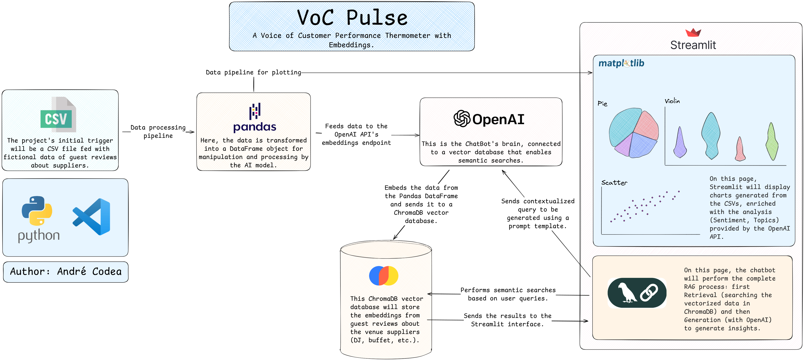

# 🌡️ VoC Pulse
*A Voice of Customer Performance Thermometer with Embeddings*

[](https://www.python.org/)
[](https://streamlit.io)
[](https://opensource.org/licenses/MIT)

This project is a Proof-of-Concept (POC) application that acts as a 'Voice of Customer' (VoC) performance thermometer, built in a 48-hour "Hackathon" sprint.

It uses the OpenAI API to read and understand unstructured customer feedback (like comments and reviews). The application automatically processes this text to extract three key pieces of data: **Sentiment** (Positive, Negative, Mixed), **Topic** (e.g., "Buffet", "DJ"), and **Embeddings** (vector representations).

---

## 🚀 Live Demo

**[>> LIVE APP DEMO ON STREAMLIT CLOUD <<](https://voc-pulse.streamlit.app/)**

---

## 📸 Screenshots


---

## Core Features

* **KPI Dashboard:** An interactive dashboard (built with Matplotlib/Seaborn) that visualizes supplier performance based on real customer sentiment.
* **Semantic Pie Charts:** An interactive pie chart that breaks down the sentiment (Positive/Negative/Mixed) for a specific, user-selected supplier.
* **Targeted Word Clouds:** A dynamic word cloud generator that shows the most frequent *keywords* (e.g., "bom", "ruim", "frio", "ótimo") for a specific supplier and sentiment.
* **Manual RAG Chatbot:** A complete Retrieval-Augmented Generation (RAG) pipeline built manually (using only `OpenAI` and `ChromaDB`) to avoid version conflicts. This allows managers to "chat" with their feedback data in plain English (e.g., "What were the biggest complaints about DJ C?") and get instant, accurate answers.

## 🏛️ Architecture Diagram

This project uses a 2-phase "Smart Hack" architecture to ensure a fast-loading (sub-3-second) production POC.



### How It Works: A 2-Phase Architecture

1.  **Phase 1: Offline AI Processing (The "Hack")**
    * The `scripts/run_pipeline.py` script is executed **one time** locally.
    * It reads the raw `data/raw/data.csv`.
    * It calls the OpenAI API (Chat + Embeddings) for all 50 rows (the slow part, ~3-5 min).
    * It saves the result to `data/processed/data_enriched.json`.
    * This JSON file (containing all AI analysis and embeddings) is **committed to the repository**.

2.  **Phase 2: Instant-Load Streamlit App (The "App")**
    * The `app.py` (the Streamlit maestro) loads.
    * It **instantly** reads the pre-processed `data_processed/data_enriched.json` file.
    * It loads the embeddings into an **in-memory** `ChromaDB` collection.
    * It loads the RAG bot (`ManualRAGBot`).
    * All this heavy data is cached in `st.session_state`.
    * The `pages/` (Dashboard, Chatbot) read from the cache, making navigation instantaneous.

## 🛠️ Tech Stack

* **Application:** Streamlit
* **AI (LLM & Embeddings):** OpenAI API
* **AI (RAG):** Manual RAG (Python)
* **Vector Database:** ChromaDB (in-memory)
* **Data Manipulation:** Pandas
* **Data Visualization:** Matplotlib, Seaborn, WordCloud
* **Configuration:** PyYAML, python-dotenv
* **Language:** Python 3.11

## 🏃 How to Run Locally

1.  **Clone the repository:**
    ```bash
    git clone [https://github.com/username/VoC-Pulse.git](https://github.com/username/VoC-Pulse.git)
    cd VoC-Pulse
    ```

2.  **Create and activate a virtual environment (venv):**
    ```bash
    python -m venv venv
    source venv/bin/activate  # (ou .\venv\Scripts\activate no Windows)
    ```

3.  **Install dependencies:**
    ```bash
    pip install -r requirements.txt
    ```

4.  **Create your 'secrets' file:**
    * Create the folder: `.streamlit/`
    * Inside it, create the file: `secrets.toml`
    * Paste your OpenAI API key into it:
        ```toml
        OPENAI_API_KEY = "sk-..."
        ```

5.  **Run the Pre-processing Pipeline (One Time):**
    * This is the critical step. It reads the raw CSV and generates the `data_enriched.json` file.
    ```bash
    python scripts/run_pipeline.py
    ```
    *(This will take 3-5 minutes. Wait for it to complete.)*

6.  **Run the Streamlit App:**
    ```bash
    streamlit run app.py
    ```
    *(The app will now load instantly, as it's reading the pre-processed JSON.)*

## ✍️ Authors

* **André Luiz de Souza Marinho Codea** - (Lead: Architecture, AI Functionalities, WebApp, GitHub Documentation)
* **João Gabriel Lima Cochet Agra** - (Data: Fictional Dataset, Matplotlib & Seaborn Plot Functions)
* **Marcos Antônio de Lana Santos** - (Data: Fictional Dataset, Matplotlib & Seaborn Plot Functions)
* **Jorge Lopes da Rocha Neto** - (Technical Documentation)
* **Gabriel de Lira Teixeira Ferreira** - (Technical Documentation)


## 📄 License

This project is licensed under the MIT License - see the [LICENSE](LICENSE) file for details.